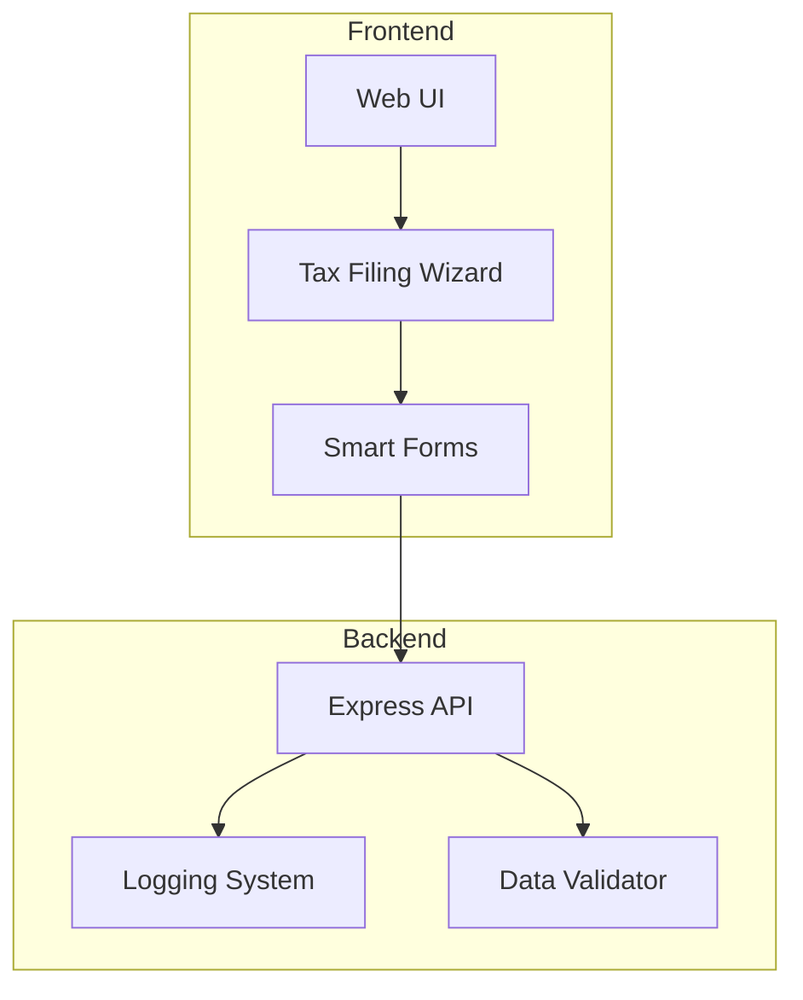
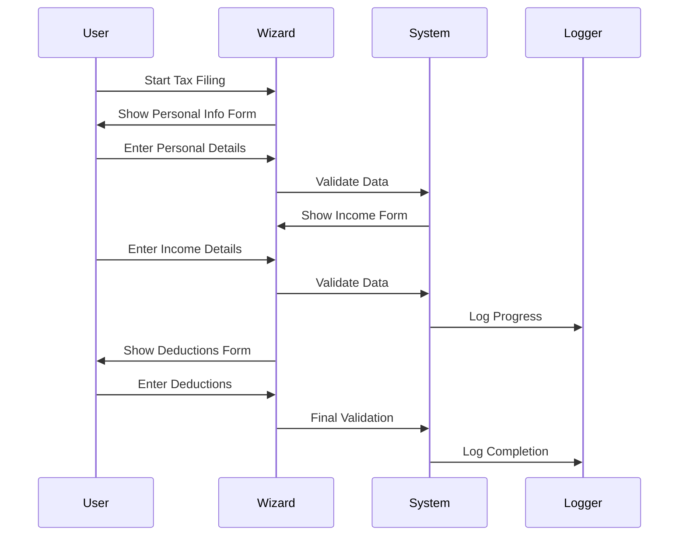
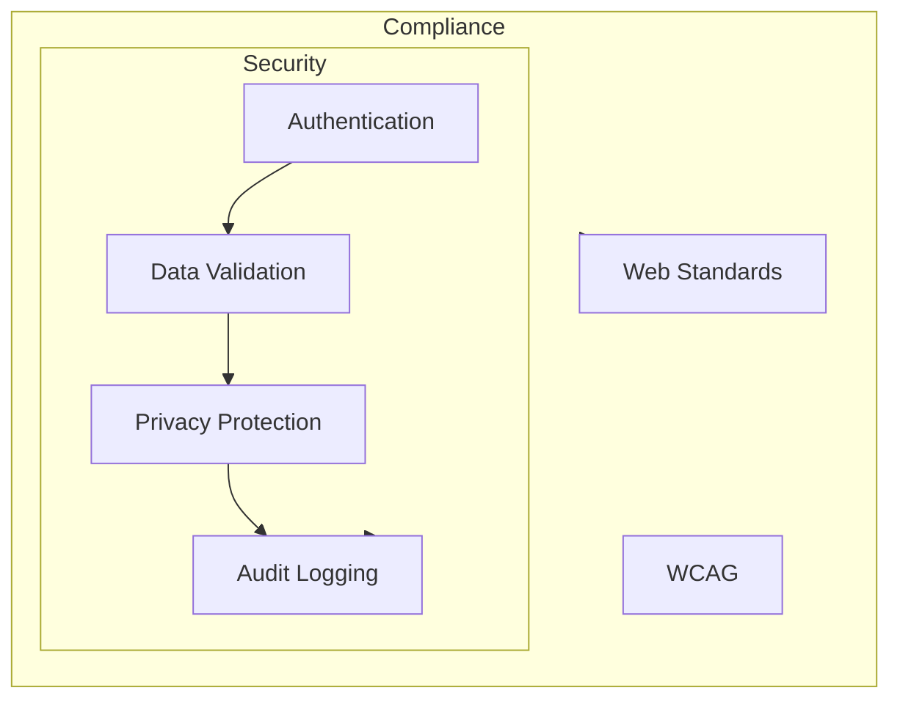

# AI Tax Filer Project Plan

## Project Overview
The AI Tax Filer is a web application designed to simplify the tax filing process using AI technology. The application provides a user-friendly interface for users to input their tax information and receive AI-powered assistance in filing their taxes.

## System Architecture

## User Flow

## Key Features

1. **Wizard-Based Interface**
   - Step-by-step tax filing process
   - Form validation
   - Progress tracking
   - Error handling

2. **Smart Forms**
   - Dynamic form generation
   - Real-time validation
   - User-friendly error messages
   - Progress indicators

3. **Backend Services**
   - RESTful API endpoints
   - Data validation
   - Logging system
   - Error handling

## Technical Stack
- Frontend: React with TypeScript, Tailwind CSS
- Backend: Node.js with Express
- Database: Logging to file system
- Development Tools: Vite, ESLint, Prettier

## Implementation Status

### Frontend (Completed)
- ✅ React application setup with TypeScript
- ✅ Tailwind CSS integration
- ✅ Form components for tax information
- ✅ Form validation
- ✅ API integration with backend
- ✅ Responsive design

### Backend (Completed)
- ✅ Express server setup
- ✅ API endpoints for form submission
- ✅ Logging system implementation
- ✅ CORS configuration
- ✅ Security middleware (helmet, rate limiting)

### Features Implemented
1. User Interface
   - Tax information input form
   - Form validation
   - Success/error messages
   - Responsive design

2. Backend Services
   - Form submission endpoint
   - Logging system
   - Security measures

3. Data Management
   - Form data validation
   - Secure data logging
   - Error handling

## Development Phases

1. **Phase 1: Foundation (Completed)**
   - Basic web UI setup
   - Wizard component implementation
   - Form validation
   - Backend API setup

2. **Phase 2: Core Features (In Progress)**
   - Additional form steps
   - Enhanced validation
   - Progress tracking
   - Logging system

3. **Phase 3: Enhancement (Planned)**
   - State management
   - Error handling
   - User guidance
   - Accessibility improvements

4. **Phase 4: Testing & Security (Planned)**
   - Security audit
   - Performance testing
   - User testing
   - Documentation

## Security Considerations

## Success Metrics

1. **User Experience**
   - Time to complete filing
   - Number of errors encountered
   - User satisfaction score
   - Form completion rate

2. **System Performance**
   - Response time
   - Validation accuracy
   - System uptime
   - Error rate

3. **Development Goals**
   - Code quality
   - Test coverage
   - Documentation completeness
   - Accessibility compliance

## Next Steps
1. Add user authentication
2. Implement tax calculation logic
3. Add PDF generation for tax forms
4. Implement AI-powered tax suggestions
5. Add multi-step form wizard
6. Implement progress tracking
7. Add data persistence

## Testing
- Frontend unit tests with Vitest
- Backend API tests
- End-to-end testing

## Deployment
- Frontend: Vercel/Netlify
- Backend: Heroku/AWS
- CI/CD pipeline setup

## Documentation
- API documentation
- User guide
- Developer documentation
- Deployment guide

## Timeline
- Phase 1 (Current): Basic form submission and logging ✅
- Phase 2: User authentication and data persistence
- Phase 3: Tax calculation and AI integration
- Phase 4: PDF generation and form wizard
- Phase 5: Testing and deployment

## Future Enhancements
1. Mobile application
2. Multi-language support
3. Integration with tax authorities
4. Real-time tax updates
5. Advanced AI features
6. Batch processing
7. Analytics dashboard

## Risk Mitigation

1. **Technical Risks**
   - Form validation accuracy
   - System scalability
   - Data security
   - Browser compatibility

2. **User Experience Risks**
   - Form complexity
   - Error messages
   - Navigation flow
   - Mobile responsiveness

3. **Operational Risks**
   - System maintenance
   - User support
   - Data backup
   - Performance monitoring 