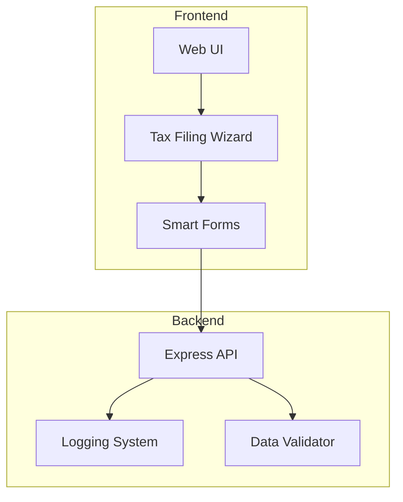
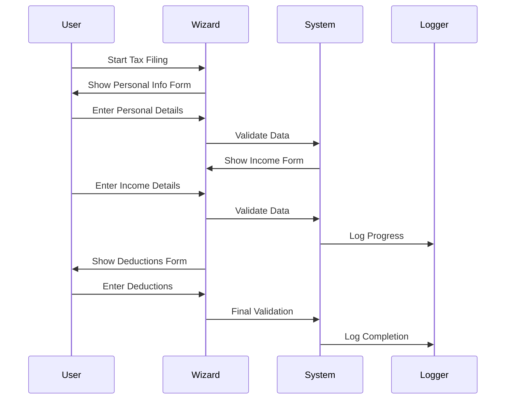
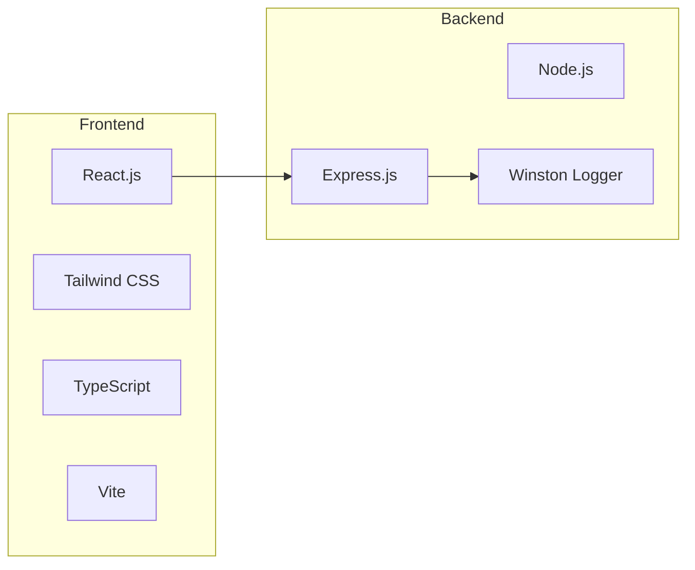
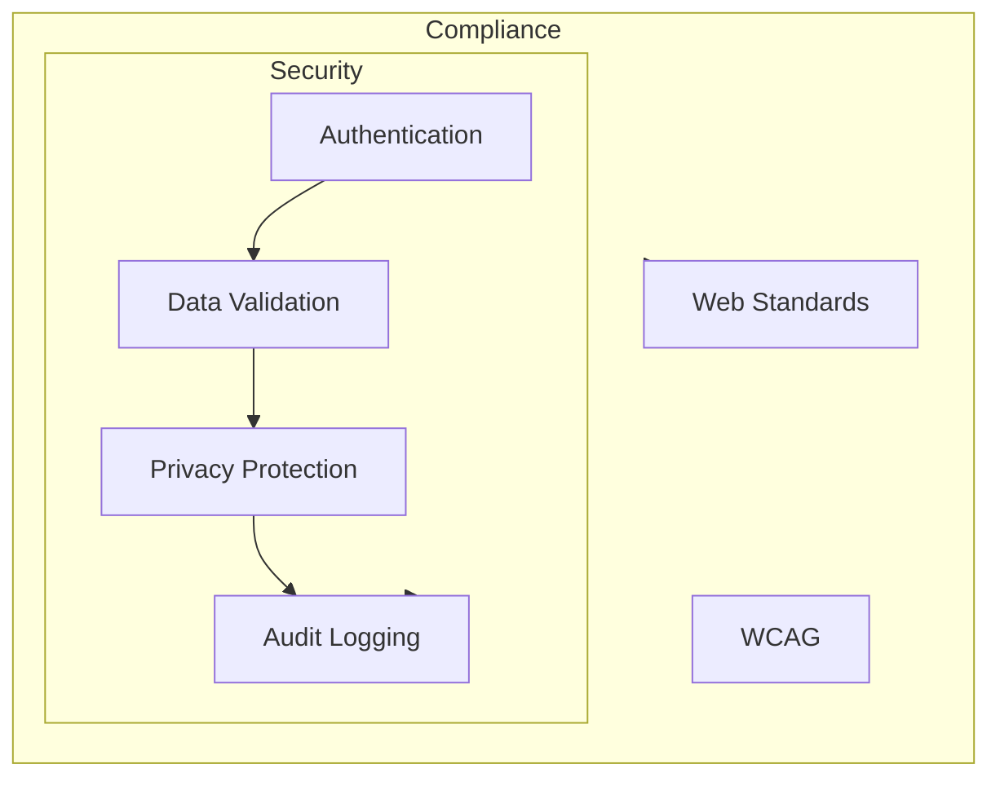

# Direct File System - Project Plan

## System Architecture

## User Flow

## Key Features

1. **Wizard-Based Interface**
   - Step-by-step tax filing process
   - Form validation
   - Progress tracking
   - Error handling

2. **Smart Forms**
   - Dynamic form generation
   - Real-time validation
   - User-friendly error messages
   - Progress indicators

3. **Backend Services**
   - RESTful API endpoints
   - Data validation
   - Logging system
   - Error handling

## Technical Stack

## Development Phases

1. **Phase 1: Foundation (Completed)**
   - Basic web UI setup
   - Wizard component implementation
   - Form validation
   - Backend API setup

2. **Phase 2: Core Features (In Progress)**
   - Additional form steps
   - Enhanced validation
   - Progress tracking
   - Logging system

3. **Phase 3: Enhancement (Planned)**
   - State management
   - Error handling
   - User guidance
   - Accessibility improvements

4. **Phase 4: Testing & Security (Planned)**
   - Security audit
   - Performance testing
   - User testing
   - Documentation

## Security Considerations

## Success Metrics

1. **User Experience**
   - Time to complete filing
   - Number of errors encountered
   - User satisfaction score
   - Form completion rate

2. **System Performance**
   - Response time
   - Validation accuracy
   - System uptime
   - Error rate

3. **Development Goals**
   - Code quality
   - Test coverage
   - Documentation completeness
   - Accessibility compliance

## Next Steps

1. Implement remaining form steps
2. Enhance validation system
3. Add state management
4. Improve error handling
5. Add accessibility features
6. Implement testing framework
7. Complete documentation
8. Security audit

## Risk Mitigation

1. **Technical Risks**
   - Form validation accuracy
   - System scalability
   - Data security
   - Browser compatibility

2. **User Experience Risks**
   - Form complexity
   - Error messages
   - Navigation flow
   - Mobile responsiveness

3. **Operational Risks**
   - System maintenance
   - User support
   - Data backup
   - Performance monitoring 