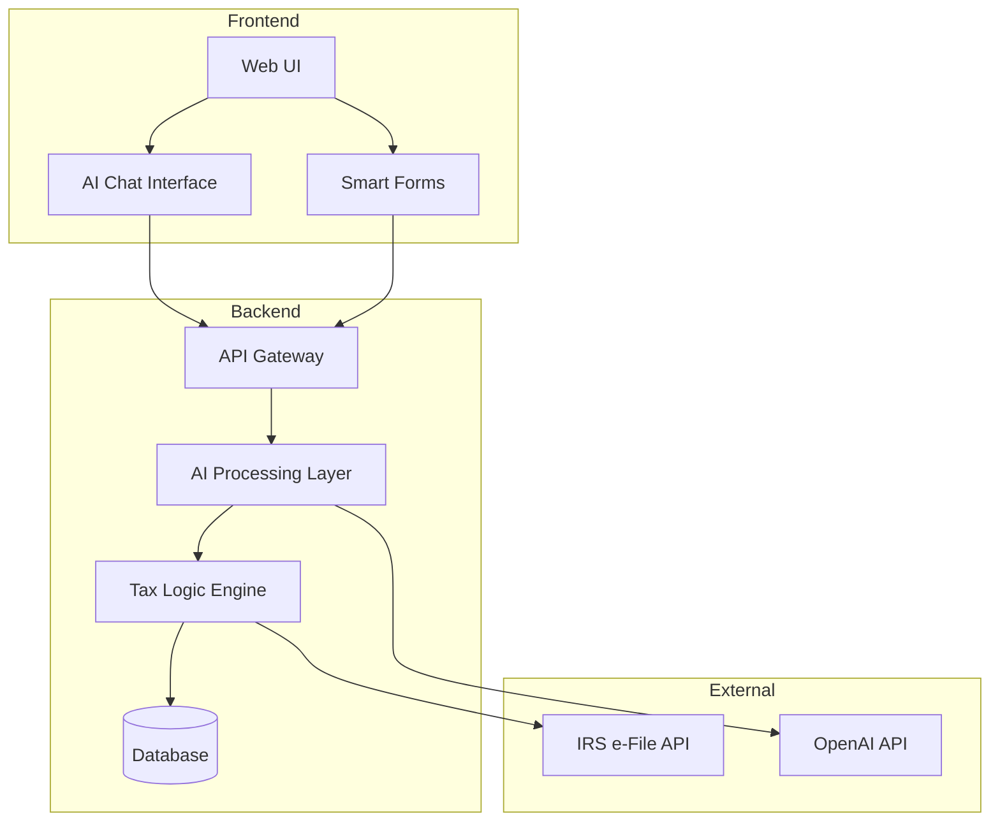
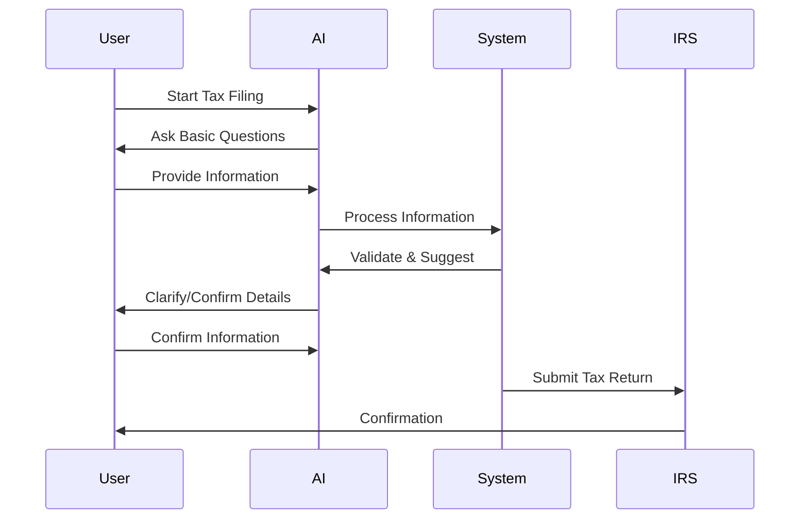
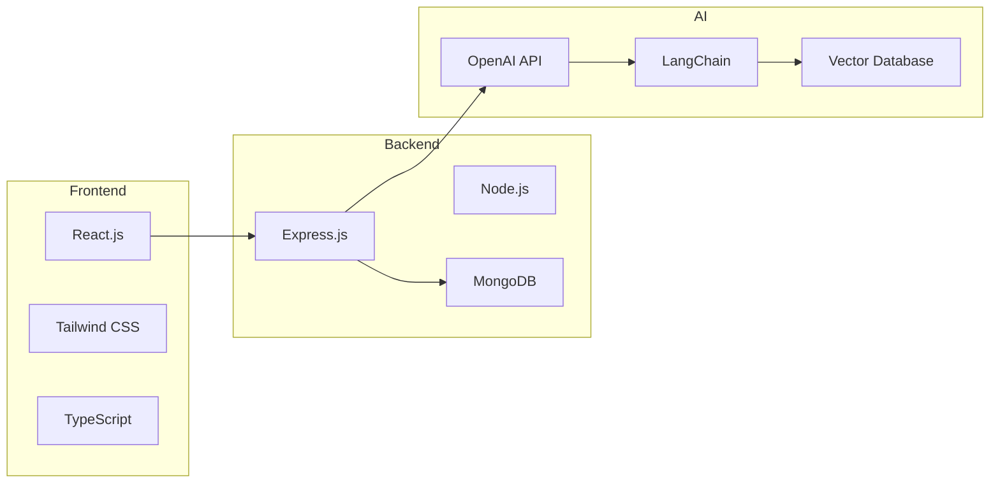
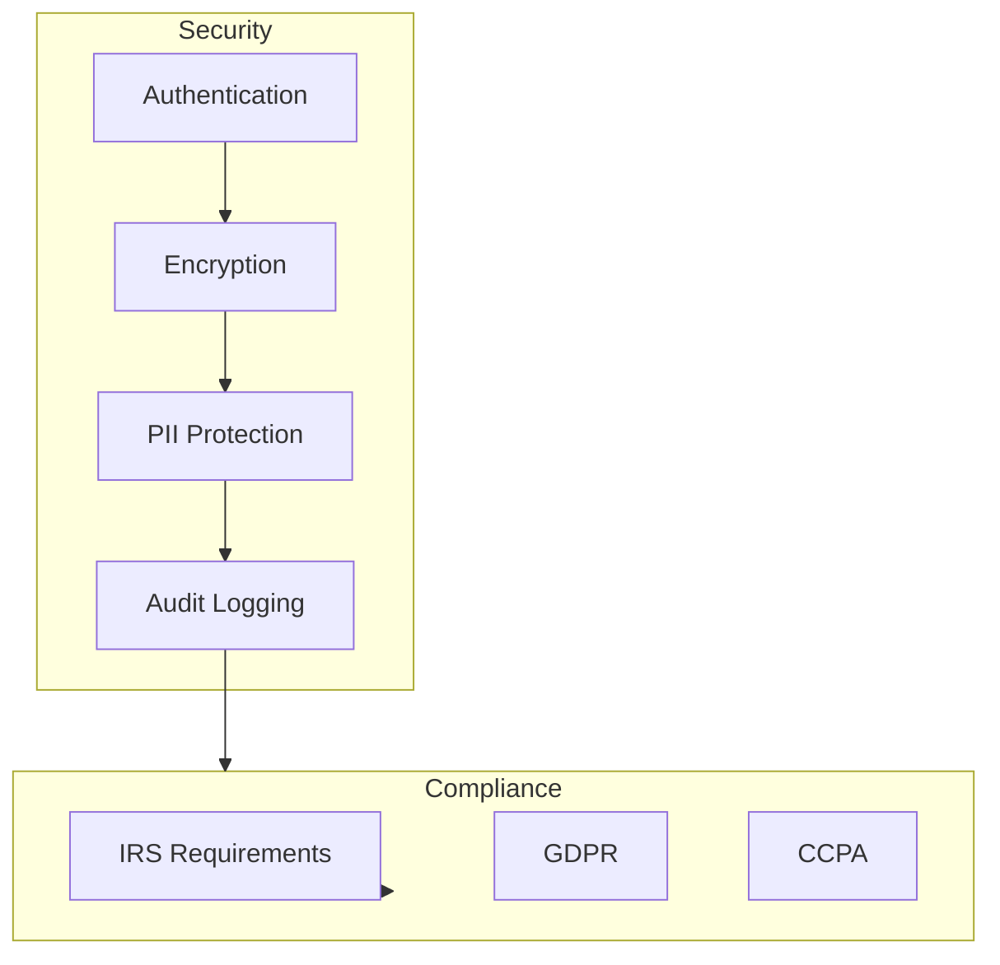

# AI-Powered Direct File System - Project Plan

## System Architecture

## User Flow

## Key Features

1. **AI-Powered Chat Interface**
   - Natural language processing for tax questions
   - Context-aware responses
   - Progressive information gathering
   - Real-time validation and suggestions

2. **Smart Forms**
   - Dynamic form generation based on user situation
   - Auto-fill capabilities
   - Real-time error checking
   - Progress tracking

3. **Tax Logic Engine**
   - Rule-based tax calculation
   - Deduction optimization
   - Compliance checking
   - Audit trail generation

## Technical Stack

## Development Phases

1. **Phase 1: Foundation (2 weeks)**
   - Basic web UI setup
   - OpenAI integration
   - Simple chat interface
   - Basic form handling

2. **Phase 2: Core Features (3 weeks)**
   - Tax logic implementation
   - Form validation
   - Data persistence
   - IRS API integration

3. **Phase 3: AI Enhancement (2 weeks)**
   - Advanced chat capabilities
   - Context management
   - Error handling
   - User guidance

4. **Phase 4: Testing & Security (2 weeks)**
   - Security audit
   - Performance testing
   - User testing
   - IRS compliance verification

## Security Considerations

## Success Metrics

1. **User Experience**
   - Time to complete filing
   - Number of questions needed
   - User satisfaction score
   - Error rate

2. **System Performance**
   - Response time
   - Accuracy rate
   - System uptime
   - Resource utilization

3. **Business Goals**
   - Number of successful filings
   - User retention
   - Cost per filing
   - IRS acceptance rate

## Next Steps

1. Set up development environment
2. Create basic project structure
3. Implement authentication system
4. Develop initial chat interface
5. Set up OpenAI integration
6. Create basic tax logic engine
7. Implement form handling system
8. Set up testing framework

## Risk Mitigation

1. **Technical Risks**
   - AI response accuracy
   - System scalability
   - Data security
   - IRS API reliability

2. **Business Risks**
   - Regulatory compliance
   - User trust
   - Cost management
   - Competition

3. **Operational Risks**
   - System maintenance
   - User support
   - Data backup
   - Disaster recovery 